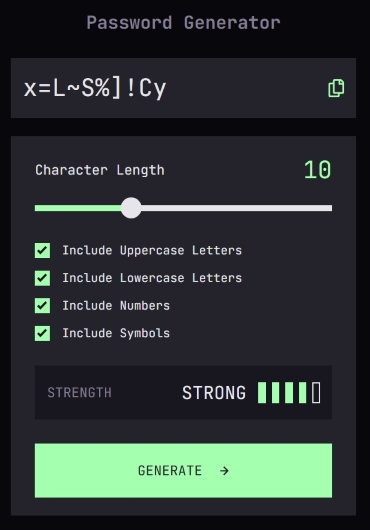
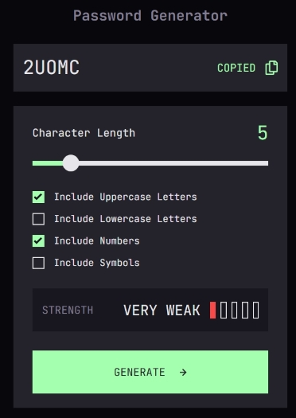

# Password Generator App

This project is a customizable password generator built with TypeScript and modern web technologies. It enables users to create secure, randomized passwords by allowing them to:

- Customize character sets: Choose to include uppercase letters, lowercase letters, numbers, and symbols.

- Adjust password length: Utilize a slider to specify the desired length of the generated password.

- Assess password strength: Receive real-time feedback via a strength indicator that evaluates password complexity based on diversity and length. The algorithm even checks against a list of common passwords to discourage predictable patterns.

- User-friendly controls: The interface provides interactive checkboxes with visual toggles for each character option, and a convenient copy-to-clipboard feature for quick password use. All the functions are keyboard accessible.

## Table of contents

- [Overview](#overview)
  - [The challenge](#the-challenge)
  - [Screenshot](#screenshot)
  - [Links](#links)
- [My process](#my-process)
  - [Built with](#built-with)
  - [What I learned](#what-i-learned)
  - [Continued development](#continued-development)
  - [Useful resources](#useful-resources)
- [Acknowledgments](#acknowledgments)
- [Author](#author)

## Overview

### The challenge

Designed with a focus on modularity and extensibility, the project ensures that:

- Error handling is in place for asynchronous requests, safely managing any issues during resource loading.

- DRY principles are prioritized by centralizing event listener assignments for checkboxes, making future enhancements easier.

- The code structure encourages maintainability and scalability, so additional features or options can be seamlessly added.

Whether you're a developer seeking to extend the functionality or a user needing a reliable tool to generate strong passwords, this project delivers a secure and intuitive solution.

### Screenshot




### Links

- Solution URL: [GitHub repo](https://github.com/BlackiePearlJoobi/password-generator-app.git)
- Live Site URL: [GitHub Pages](https://blackiepearljoobi.github.io/password-generator-app/)

## My process

### Built with

- Semantic HTML5 markup
- CSS custom properties
- Flexbox
- Mobile-first workflow
- Vanilla Typescript

### What I learned

#### HTML

1. Using `<output>` for Dynamic Data

   - Using the `<output>` tag instead of using a `<div>` or `<span>` for displaying the generated password, explicitly communicating that the value is computed, and making it more meaningful for browsers and assistive devices.

```html
<div class="result-container">
  <output id="result">P4$5W0rD!</output>
  <div class="copier-container">
    <!--contents -->
  </div>
</div>
```

2. Enhancing Accessibility with ARIA and Keyboard Support

   - Added `aria-label` to buttons (like the copy button) for better screen reader support.

   - Used `tabindex="0"` on custom checkboxes to make them keyboard accessible.

   - Linked `<label>` elements to inputs using the for attribute, improving form usability.

#### CSS

1. Using CSS Variables for Scalability

   - Defined global CSS variables (`--font-size-1, --gray-800, --green`, etc.) within `:root` to ensure a consistent and manageable theme.

   - Applied `font-size` and `line-height` variables for better text uniformity across breakpoints.

2. Accessibility & Readability Improvements

   - Ensured readable color contrasts (`var(--gray-200)` for text, `var(--gray-800)` for backgrounds).

   - Styled interactive elements (`#copy-btn`, `.checkbox`, `#generate-btn`) for clear visual feedback.

3. Flexbox for Layout Control

   - Implemented display: `flex` and `flex-direction: column` across major containers (`.wrapper`, `.generator-container`) for responsive design.

4. Styling Interactive Components

   - Checkboxes & Toggles: Customized `.checkbox-hidden` to ensure checkboxes don’t appear visually, using `.checkbox` as a styled alternative with an icon.

   - Slider Styling:

     - Applied `&::-webkit-slider-thumb` and `&::-moz-range-thumb` for cross-browser support.

     - Used `var(--track-fill)` to dynamically update the track color.

```css
#slider {
  /* reset styles */
  -webkit-appearance: none;
  appearance: none;
  background: transparent;
  cursor: pointer;
  width: 100%;
  height: 28px;

  /***** Track Styles *****/
  /***** Chrome, Safari, Opera, and Edge Chromium *****/
  &::-webkit-slider-runnable-track {
    background: var(--track-fill);
    height: 8px;
  }

  /******** Firefox ********/
  &::-moz-range-track {
    background: var(--track-fill);
    height: 8px;
  }
}
```

5. Responsive Design Considerations

   - Media Queries (`@media (min-width: 641px)`) adjust:

     - Font sizes (`var(--font-size-2)` for larger screens).

     - Layout positioning (`margin: auto 5%` for the main container).

     - Button sizes (`height: 72px` for wider screens).

   - Ensured `min-height: 100vh` in `.wrapper` for full viewport coverage, preventing layout cutoffs.

#### Typescript

1. Strong Typing for Reliability

   - Defined explicit types (`type characters = (string | number)[]`) to ensure type safety and avoid runtime errors.

   - Used TypeScript’s `Record<key, value>` type for managing inclusion options dynamically (`Record<OptionName, boolean>`), improving readability and scalability.

2. Modular & Maintainable Code

   - followed a modular approach with functions dedicated to specific tasks, improving readability and efficiency.

   - `setSlider(currentLength: number, maxLength: number)`

     - Dynamically adjusts the slider track fill color using a percentage-based CSS property (`--track-fill`).

     - Helps provide visual feedback when users adjust password length.

   - `rateStrength(password: (string | number)[]): [string, number]`

     - Evaluates password strength based on:

       - Length (short passwords reduce strength, longer ones increase it).

       - Character diversity (uppercase, lowercase, numbers, and symbols).

       - Common password check (prevents easily guessable passwords).

     - Returns a strength rating ("VERY WEAK", "WEAK", "MEDIUM", etc.), improving security awareness.

   - `updateIndicator(rating: number)`

     - Adjusts visual indicators (colored bars) to reflect password strength.

     - Uses a switch-case structure to apply appropriate colors (red, orange, green, etc.), enhancing UX clarity.

   - Refactored toggle functions into a single, reusable `toggleOption()` function to eliminate redundant logic.

3. Event Handling & Accessibility

   - Implemented `try...catch` for asynchronous password loading (`loadCommonPasswords`), preventing network-related errors.

   - Centralized event listener assignments for checkboxes via `.forEach()`, reducing repetition.

4. Improving Scalability

   - Structured logic to allow future enhancements, such as new password options or advanced strength algorithms.

   - Ensured that modular functions (like `rateStrength`) make extending security features easy.

### Continued development

As the project evolves, here are some planned improvements and enhancements:

1. Advanced Password Strength Algorithm

   - Enhance the `rateStrength()` function with entropy-based calculations, making strength assessments more accurate.

   - Include an AI-driven password evaluator that suggests stronger alternatives when weak passwords are generated.

2. Additional Password Options

   - Add custom character set selection, allowing users to specify exact character pools.

   - Introduce an exclude similar characters feature to improve password readability (avoiding characters like 0, O, I, l, etc.).

3. Accessibility & UI Enhancements

   - Implement ARIA live regions for real-time feedback on password strength.

4. Expanded Features

   - Allow saving generated passwords securely within a local storage vault.

   - Enable bulk password generation, useful for creating multiple secure passwords at once.

### Useful resources

Throughout the development of this project, the following resources were particularly helpful:

- [Creating a Custom Range Input That’s Consistent Across Browsers](https://www.smashingmagazine.com/2021/12/create-custom-range-input-consistent-browsers/) - This article provided insights on ensuring range inputs are visually and functionally consistent across different browsers. It helped optimize the slider component for password length selection.

- [UIC Strong Password Guidelines](https://www.uic.edu/apps/strong-password/) - This resource helped shape the password strength evaluation logic by outlining best practices for secure passwords. It informed the design of the rateStrength() function, ensuring robust criteria for assessing complexity.

These references were instrumental in refining usability, accessibility, and security within the project.

## Acknowledgments

This is a solution to the [Password generator app challenge on Frontend Mentor](https://www.frontendmentor.io/challenges/password-generator-app-Mr8CLycqjh). Frontend Mentor challenges help you improve your coding skills by building realistic projects.

## Author

- Frontend Mentor - [@BlackiePearlJoobi](https://www.frontendmentor.io/profile/BlackiePearlJoobi)
- devChallenges - [@Moonychan](https://devchallenges.io/profile/568d1c62-28c2-40d3-8772-cce03ae0c707)
